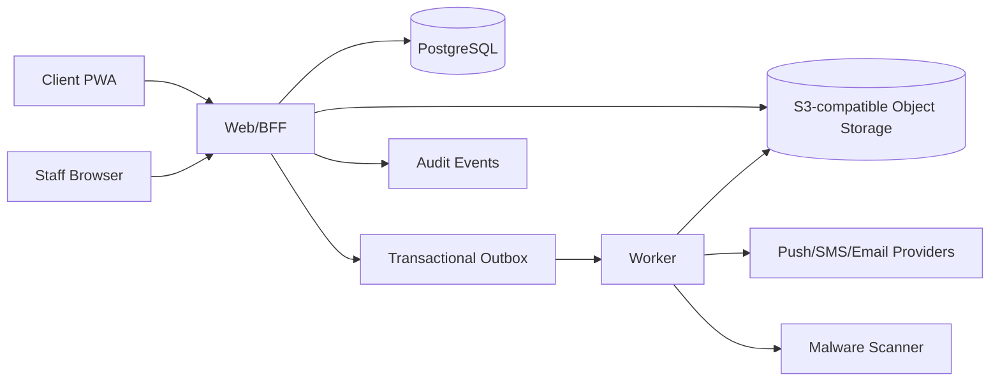
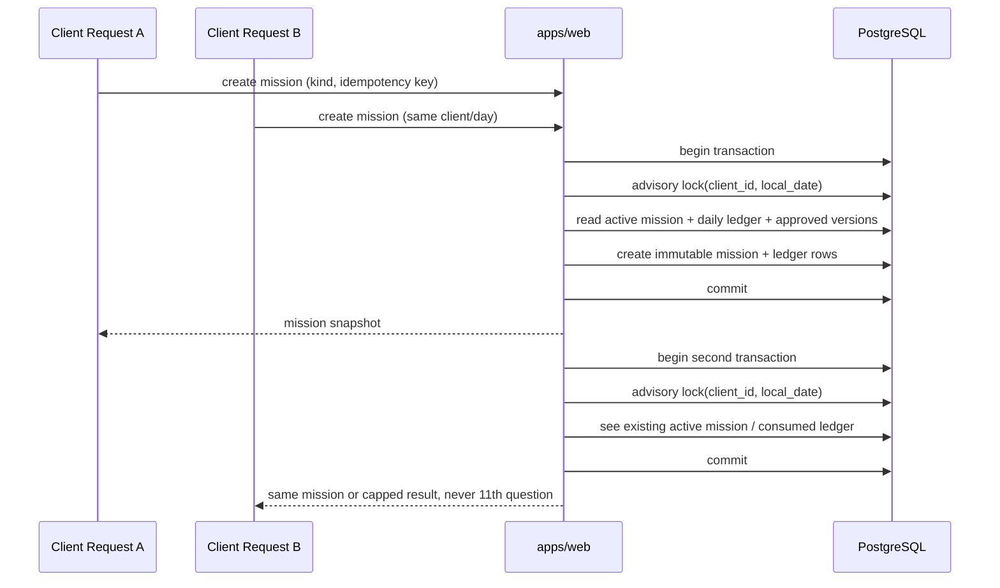

# Architecture — Honey Case Adventure

## 1. Architecture style

Use a modular monolith with a separate worker process. This preserves transactional consistency and keeps the deployment understandable while allowing clear boundaries for later extraction.



## 1.1 Task 02 repository state

Task 02 is now implemented around three server-side invariants:

- question missions are created on the server, never assembled in the browser
- only `APPROVED` question versions can enter new missions
- the 10-question daily cap is reserved atomically during mission creation

## 2. Package boundaries

### `packages/domain`

Pure TypeScript. No React, HTTP, ORM, or provider imports.

Contains:

- question eligibility and scoring
- daily budget policy
- mission state machine
- review-flag evaluation
- Honey progression policy
- notification event policy
- value objects and domain errors

### `packages/db`

Contains schema, migrations, repositories, and transaction helpers. Domain services depend on repository interfaces; app composition binds implementations.

### `apps/web`

Contains:

- client and staff UI
- server actions/API handlers
- authentication callbacks
- authorization policy enforcement
- input validation
- presigned upload initiation
- outbox event creation

### `apps/worker`

Contains:

- outbox polling with `FOR UPDATE SKIP LOCKED`
- notification delivery and retries
- malware scan orchestration
- evidence promotion from quarantine to clean storage
- dead-letter handling

## 3. Trust boundaries

Untrusted:

- all browser input
- invitation tokens
- OTP attempts
- uploaded file bytes and metadata
- notification provider callbacks
- locale cookies
- serialized rule data until schema validated

Trusted only after verification:

- authenticated session identity
- organization membership loaded server-side
- immutable published question version
- clean evidence object

## 4. Mission state model

Suggested states:

- `CREATED`
- `ACTIVE`
- `PAUSED`
- `COMPLETED`
- `CANCELLED`

A mission has ordered slots. A slot is allocated only when needed, allowing branching without rewriting prior history.

Slot states:

- `ALLOCATED`
- `PRESENTED`
- `ANSWERED`
- `SKIPPED`

Once allocated, `question_version_id` is immutable.

## 5. Daily question-budget algorithm

Definition: the daily cap applies to distinct substantive mission slots opened by the client during the client’s local calendar day.

Required transaction:

1. Resolve the client’s IANA time zone and calculate local date.
2. Begin transaction.
3. Acquire a transaction-scoped advisory lock keyed by client ID and local date, or lock a dedicated budget row.
4. Check whether a `daily_question_interaction` already exists for the slot and date.
5. If not, count interactions for that date.
6. Reject allocation/presentation when count is already 10.
7. Create the unique interaction row.
8. Mark slot presented if needed.
9. Commit.

Required database constraints:

- unique `(client_id, local_date, question_definition_id)`
- unique `(mission_slot_id)`
- check or application invariant ensuring no configured budget above 10
- unique slot position within a mission

Test two concurrent requests from multiple sessions and prove the count never exceeds 10.

### Implemented Task 02 flow



## 6. Branching engine

Use a versioned JSON DSL, not executable JavaScript.

Example:

```json
{
  "all": [
    {
      "fact": "answer",
      "questionKey": "schedule.shift_over_5h",
      "op": "eq",
      "value": true
    },
    { "fact": "matter.currentlyEmployed", "op": "eq", "value": true }
  ]
}
```

Supported combinators:

- `all`
- `any`
- `not`

Supported operators should be intentionally small:

- `eq`, `neq`
- `in`, `not_in`
- `exists`
- `gt`, `gte`, `lt`, `lte`
- `contains`
- approved date comparisons

The rule evaluator must be total: malformed or unsupported rules return a typed failure and are not served.

In the current implementation, malformed rules fail closed in the selector and
cannot add a question to a mission. Review-flag derivation uses the same
declarative evaluation model and remains side-effect free.

Selection order:

1. required clarification
2. direct branch follow-up
3. unanswered foundational question
4. category completion gap
5. high-priority general question

Pacing modifiers:

- do not serve two high-sensitivity questions consecutively
- favor a simple question after a high-effort question
- deterministic tie-break based on stable input, not randomness

## 7. Answer persistence

- Validate against the immutable question version’s answer schema.
- Save with an idempotency key.
- Maintain current answer plus append-only revisions, or derive current value from revisions.
- Use optimistic concurrency when the same answer is edited from multiple devices.
- Create review flags and progression events in the same transaction or through an outbox event.
- Return authoritative save status and revision number.

## 8. Transactional outbox

Every side effect begins as an outbox record committed with the source transaction.

Fields:

- id
- organization ID
- event type
- aggregate type and ID
- idempotency key
- redacted payload
- available at
- attempt count
- status
- last error class
- created/processed timestamps

Worker behavior:

- claim rows using `FOR UPDATE SKIP LOCKED`
- exponential backoff with jitter
- provider-specific idempotency
- dead-letter after configured threshold
- no PII in logs

## 9. PWA and caching

Cache only:

- hashed static assets
- public icons
- offline shell containing no client data

Never cache:

- authenticated HTML
- API or server-action responses
- answers
- evidence URLs
- staff pages
- invitation pages containing tokens

Set explicit `Cache-Control: no-store` on sensitive routes. Clear application caches on logout when feasible. Do not implement background sync for answer payloads in the MVP.

## 10. Install detection

Use evidence levels rather than a single boolean:

- `PROMPT_AVAILABLE`
- `PROMPT_ACCEPTED`
- `APPINSTALLED_EVENT_OBSERVED`
- `STANDALONE_FIRST_LAUNCH`
- `PUSH_SUBSCRIBED`

Browser support varies. The server stores event source and confidence. Staff UI displays precise language such as “Standalone app launched” instead of an unsupported universal claim.

## 11. Evidence pipeline

1. Authenticated client requests upload intent.
2. Server validates declared type/size and creates `EvidenceDocument` in `PENDING_UPLOAD`.
3. Server returns short-lived presigned quarantine upload URL.
4. Client uploads directly.
5. Completion endpoint verifies object metadata and queues scan.
6. Worker sniffs magic bytes, enforces actual type/size, and invokes scanner.
7. Clean object is copied/moved to clean prefix or bucket.
8. Staff access uses short-lived signed URLs generated after authorization.
9. Infected or unscannable objects remain quarantined and unavailable.

## 12. Authorization

Every server use case receives an actor context created from the session:

- actor ID
- organization ID
- role
- assigned client/matter permissions where applicable

Repositories do not accept organization IDs from browser payloads. Staff reads of client detail create an audit event. Client queries are always scoped to the authenticated client identity.

## 13. Task 01 implementation note

The current vertical slice implements:

- custom database-backed opaque sessions for local development
- phone-first development OTP verification
- versioned approved questions for the quick mission path
- append-only answer revisions and current-answer projection
- transactional outbox plus worker-created staff in-app notifications
- development-only staff authentication with explicit `STAFF` and `ADMIN` role checks

Deferred from Task 01:

- Google Workspace OIDC production integration
- external SMS/email/web-push providers
- evidence upload and malware scanning
- generalized daily-cap concurrency logic from Task 02

## 13. Observability

Structured logs:

- timestamp
- level
- request ID
- route or use-case name
- opaque actor ID
- organization ID
- latency
- result/error class

Metrics:

- answer save latency and failures
- daily-cap rejections
- mission completion rate
- outbox age and retry count
- notification delivery status
- evidence scan queue age
- authorization denials

Tracing is recommended across web request, DB transaction, outbox event, and provider delivery.

## 14. Deployment

Local Docker Compose:

- PostgreSQL
- MinIO
- Mailpit or console mail provider
- optional local malware scanner

Production requires:

- managed PostgreSQL with encrypted backups
- private object storage
- HTTPS only
- secrets manager
- worker autoscaling or controlled concurrency
- production OTP/SSO/notification providers
- malware scanner
- centralized logs with redaction
- backup restore test

Do not call the system production-ready until these integrations are live and verified.
