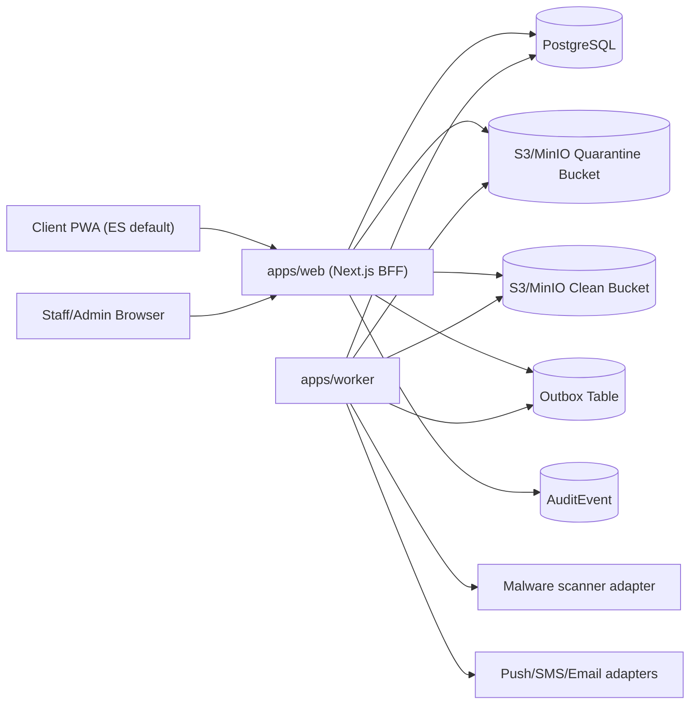

# RFC-001: Honey MVP Repository Plan

## Status

Task 02 implemented in repository on July 11, 2026.

## Task 02 Decision Summary

- The repository now uses a PostgreSQL-enforced `DailyQuestionLedger` to cap
  distinct substantive question presentations at 10 per client local day.
- Mission creation uses a transaction-scoped advisory lock keyed by
  `(client_id, local_date)` plus a unique ledger constraint on
  `(client_id, local_date, question_definition_id)`.
- Mission snapshots are immutable and persist exact approved version IDs and
  order.
- Branching uses a small validated JSON DSL and fails closed on malformed
  rules.
- Client mission size choices are fixed at 3, 5, or up to 10 remaining daily
  substantive slots.
- Staff can read question content; only ADMIN can draft, approve, or retire
  question versions.
- Approved question content remains immutable; approval creates a new version
  instead of editing published content in place.
- Time-zone changes are audited and only affect future local-date calculations.

## Purpose

This RFC turns the current document-only repository into a concrete implementation plan for the Honey Case Adventure MVP. It is intentionally repository-specific: the current workspace contains product, architecture, security, data-model, and task briefs, but no application code, package manager manifests, CI configuration, database schema, auth implementation, or deployment assets.

## Repository assessment

### Current state

- The repository currently contains only documentation and the Honey source image.
- There is no `package.json`, workspace manifest, lockfile, application source tree, test suite, Docker configuration, CI workflow, or database migration history.
- There is no existing authentication stack, ORM, object-storage adapter, worker runtime, or deployment baseline to preserve.
- The provided workspace is not a Git repository, so branch-based rollback points and CI references in this plan describe the target repository state after initialization rather than current metadata.

### Implications

- The baseline stack from [AGENTS.md](/Users/davidmun/Downloads/honey-codex-senior-engineering-pack/AGENTS.md) should be treated as authoritative unless superseded by these ADRs.
- The plan must bootstrap the repository foundation before any feature work.
- Validation commands below are the commands that the repository must support after each milestone; they are not available yet in the current workspace.

## Goals

- Build a secure modular monolith with a separate worker and explicit package boundaries.
- Make Spanish the default client language while keeping English available everywhere.
- Enforce the 10-question daily cap server-side under retries, multiple tabs, and concurrency.
- Keep all sensitive data out of caches, notifications, analytics payloads, and logs.
- Support a truthful PWA experience without overstating installation certainty.
- Keep every milestone runnable from a clean checkout.

## Task 02 Delivered Scope

- Versioned question content with `DRAFT`, `APPROVED`, and `RETIRED` states.
- Deterministic question selection with clarification priority, branch
  eligibility, category coverage, and emotional/effort pacing.
- Daily-cap concurrency protection using PostgreSQL transactions and locking.
- Review-flag generation from declarative rules without client-visible legal
  conclusions.
- Minimal admin content workflow for draft creation, approval, retirement, and
  snapshot visibility.
- Deterministic fictional bilingual seed set across the required employment and
  wage-and-hour categories.

## Non-goals

- No native mobile applications.
- No AI legal advice or merit scoring.
- No production-readiness claims for external providers without credentials and real end-to-end tests.

## Conflicts and gaps between the requested architecture and the current repository

| Area             | Current repository             | Required architecture                                                                                  | Resolution                                          |
| ---------------- | ------------------------------ | ------------------------------------------------------------------------------------------------------ | --------------------------------------------------- |
| Workspace        | No app code or package manager | `pnpm` monorepo with `apps/` and `packages/`                                                           | Bootstrap a new workspace in Milestone 0            |
| Web/BFF          | No framework                   | Next.js App Router PWA                                                                                 | Create `apps/web`                                   |
| Background jobs  | No worker                      | Separate outbox and evidence-scan worker                                                               | Create `apps/worker`                                |
| Domain isolation | No package boundaries          | Pure framework-independent domain package                                                              | Create `packages/domain` and service interfaces     |
| Persistence      | No schema or migrations        | PostgreSQL with forward-only migrations                                                                | Create `packages/db` with Prisma and SQL migrations |
| Auth             | No auth implementation         | Phone-first OTP for clients, Google-compatible OIDC/SSO for staff, secure cookies, DB-backed allowlist | Implement via Auth.js with provider interfaces      |
| Storage          | No object storage              | S3-compatible quarantine and clean evidence storage                                                    | Use MinIO locally, S3-compatible adapter in prod    |
| Caching          | No service worker              | Offline shell only, no authenticated caching                                                           | PWA policy in `apps/web` plus browser tests         |
| Testing          | No test tools                  | Unit, integration, Playwright, security regression, `pnpm verify`                                      | Establish test pyramid in Milestone 0               |
| CI/CD            | No workflows                   | Deterministic local/CI gates                                                                           | Add CI in Milestone 5                               |

## Proposed repository shape

```text
apps/
  web/                  # Next.js App Router, server/BFF, PWA, staff UI
  worker/               # Outbox delivery, malware scan orchestration
packages/
  config/               # Zod-validated environment and shared config
  db/                   # Prisma schema, migrations, repositories, SQL helpers
  domain/               # Pure domain rules, policies, value objects
  i18n/                 # Typed ES/EN catalogs and locale helpers
  testing/              # Factories, fixtures, test helpers
  ui/                   # Accessible shared UI primitives
docs/
  adr/
  runbooks/
```

## System context



## Package boundaries

### `packages/domain`

- Owns mission sizing, daily budget rules, branching evaluation, pacing, review-flag evaluation, Honey progression, notification policy, and domain errors.
- Exposes pure functions and interfaces only.
- Must not import Prisma, React, Next.js, browser APIs, or provider SDKs.

### `packages/db`

- Owns Prisma schema, forward-only migrations, repository implementations, SQL helpers, and transaction utilities.
- Uses parameterized raw SQL where Prisma does not model the required PostgreSQL primitives well enough, especially advisory locks and `FOR UPDATE SKIP LOCKED`.

### `packages/config`

- Owns environment parsing and shared runtime configuration.
- Defines fail-closed production requirements, including disabling dev OTP in production.

### `packages/i18n`

- Owns typed message catalogs, locale routing helpers, and message-key definitions.
- Prevents scattering untranslated strings across components.

### `packages/ui`

- Owns accessible primitives, form states, motion tokens, and Honey framing styles.
- Must preserve 44x44 touch targets and reduced-motion support.

### `packages/testing`

- Owns factory data, fake adapters, concurrency helpers, Playwright utilities, and redaction assertions.

### `apps/web`

- Owns client and staff UI, route handlers, auth integration, authorization gates, session handling, upload intent endpoints, answer autosave endpoints, and audit event creation.

### `apps/worker`

- Owns outbox polling, provider delivery, evidence scan orchestration, retries, and dead-letter handling.

## Request flows

### Invitation to mission flow

1. Client opens a signed invitation link.
2. `apps/web` hashes the supplied token and resolves the invitation without revealing whether the contact exists.
3. Client verifies via OTP challenge.
4. The server rotates the session identifier after successful verification.
5. The client records consent and onboarding answers through validated route handlers.
6. Mission creation stores requested size, locale, and the first allocated slot.
7. Each answer submission writes an append-only revision, updates the current projection, enqueues any outbox events, and allocates the next slot when appropriate.

### Staff client-detail flow

1. Staff authenticates through a local development credential path or Google Workspace-compatible production OIDC provider.
2. Every request constructs an actor context from the server session.
3. Successful Google login alone is insufficient; the server also checks a database-backed allowlist and explicit role assignment.
4. Server repositories scope reads by organization and authorization policy, not by browser-supplied organization IDs.
5. Opening a client detail page creates an audit event.
6. Evidence links are generated only for `CLEAN` files unless the actor has the explicit security-admin capability.

## Background-event flows

### Outbox flow

1. Source transaction inserts an outbox row with a redacted payload.
2. Worker claims a batch using `FOR UPDATE SKIP LOCKED`.
3. Worker delivers to a provider adapter using a provider-specific idempotency key.
4. Success marks the row processed.
5. Retryable failures increase attempt count and set a future `available_at`.
6. Terminal failures move the row to dead-letter state without dropping the audit trail.

### Evidence flow

1. Client requests upload intent.
2. Server validates declared size/type and creates an `EvidenceDocument` in `PENDING_UPLOAD`.
3. Server returns a short-lived presigned URL for quarantine storage.
4. Client uploads directly to quarantine.
5. Completion callback verifies metadata and enqueues a scan event.
6. Worker fetches object metadata, sniffs magic bytes, enforces the allowlist, runs the malware-scan adapter, and fails closed on scanner errors.
7. Clean objects are copied to clean storage using randomized keys; infected or unscannable objects remain unavailable.
8. Staff download uses an authorized short-lived signed URL to the clean object only.

## Daily-cap algorithm

The daily cap applies to distinct substantive slots first opened during the client’s local calendar day.

### Storage design

- `daily_question_interactions`
  - unique `(client_id, local_date, mission_slot_id)`
- `mission_slots`
  - unique `(mission_id, position)`
- `answer_revisions`
  - unique `(mission_slot_id, revision_number)`
  - unique `(client_id, idempotency_key)`

### Allocation transaction

1. Resolve the client time zone from persisted client profile data, not browser input.
2. Compute local date using the stored IANA zone.
3. Begin a database transaction.
4. Acquire `pg_advisory_xact_lock(hash(client_id, local_date))`.
5. Re-read the mission and the candidate slot in the transaction.
6. If an interaction already exists for `(client_id, local_date, mission_slot_id)`, reuse it and do not consume budget.
7. Otherwise count current interactions for the local date inside the same transaction.
8. If the count is already 10, reject new presentation or extension.
9. Insert the new daily interaction row and mark the slot presented.
10. Commit.

### Why this design

- It is correct under retries, multiple tabs, and concurrent requests.
- It does not trust client-side counters or service-worker state.
- It preserves the invariant that reopening the same slot does not consume a second unit that day.

## Question versioning and branching

### Versioning

- `QuestionDefinition` provides a stable business key.
- `QuestionVersion` is immutable after publication.
- `MissionSlot.question_version_id` never changes after allocation.
- Production serves only `APPROVED` versions unless an emergency flag is enabled and audited.

### Branching

- Rules use a small JSON DSL validated by Zod before use.
- The evaluator is total: unsupported or malformed rules produce typed failures and the version is withheld from client-serving paths.
- Candidate selection order:
  1. required clarification
  2. direct follow-up branch
  3. foundational unanswered question
  4. category completion gap
  5. general priority
- Pacing rules prevent consecutive high-sensitivity questions when a lower-sensitivity eligible option exists.
- Tie-breaks are deterministic and derived from stable inputs, never randomness.

## Authentication and authorization model

### Client authentication

- Passwordless OTP with mobile phone number as the primary identifier and E.164 normalization.
- OTP provider abstraction supports SMS and email, but Task 01 implements only the secure development provider.
- OTP code values are random, single-use, short-lived, hashed at rest, and rate limited by account hash and IP hash.
- Resend throttling and generic responses prevent account enumeration.
- Dev OTP visibility is allowed only in an explicit development-only interface or local server console and must be hard-disabled in production config.

### Staff authentication

- Development-only seeded credentials or local OIDC substitute for Milestone 1.
- Production path is Google Workspace-compatible OIDC/SSO with MFA expectation.
- Authorization is based on a database-backed allowlist plus explicit `STAFF` or `ADMIN` role assignment, not solely on email domain membership.

### Sessions

- Secure, HttpOnly cookies.
- `Secure` required in production.
- Session ID rotation on auth and privilege changes.
- Separate role-aware authorization middleware is not enough by itself; every server use case performs its own actor-policy checks.

### Authorization

- Actor context includes `actorType`, `actorId`, `organizationId`, `role`, and optional assignments.
- Browser-supplied organization IDs are ignored.
- Client routes are always scoped to the authenticated client identity.
- Staff routes require server-side authorization on every request and create audit events for sensitive reads and exports.

## Evidence quarantine and scan flow

- All uploads go to quarantine first.
- Storage keys are randomized; original filenames are stored only as sensitive metadata.
- Magic-byte verification happens after upload.
- Staff access is denied for `PENDING_UPLOAD`, `SCANNING`, `REJECTED`, and `ERROR`.
- Only a security-admin capability may inspect quarantined metadata needed for incident handling.
- The scanner integration is provider-neutral, with ClamAV intended for local development and early infrastructure.
- Production processing fails closed if no real scanner is configured.

## PWA cache policy

### Cached

- Build-hashed static assets
- manifest
- public icons
- a static offline shell with generic content only

### Never cached

- authenticated HTML
- route-handler responses containing session or answer data
- invitation pages with signed tokens
- staff pages
- evidence URLs
- answer payloads

### Enforcement

- Sensitive routes return `Cache-Control: no-store`.
- Service worker excludes authenticated routes entirely.
- Logout clears app-managed caches and in-memory state where feasible.
- No background sync for answer payloads in the MVP.

## Install-event confidence semantics

There is no single reliable “downloaded the app” event across browsers. The system will persist separate evidence-bearing events:

- `install_prompt_available`
- `install_prompt_accepted`
- `appinstalled_event_observed`
- `standalone_first_launch`
- `push_subscription_activated`

Staff UI language must reflect confidence level exactly, for example “Standalone app launched” instead of “App installed” when only standalone launch is provable.

## Notification delivery semantics

- Notifications originate from committed outbox records only.
- Provider adapters receive deduplication keys derived from the source event.
- Stub adapters are labeled as development-only and never claim real delivery.
- Staff in-app notifications are the first real MVP notification channel.
- Email and web push remain provider abstractions until later milestones.
- SMS reminder flows stay behind a disabled feature flag.
- Lock-screen text stays generic and locale-aware.
- Consent, quiet hours, channel revocation, and locale are evaluated before send.
- No notification payload may include employer name, issue category, filenames, answers, or free text.

## Retention model

- Retention is configuration-driven rather than hard-coded in feature logic.
- Initial policy defaults:
  - unused invitations expire after 30 days
  - abandoned incomplete intake data becomes eligible for review after 12 months of inactivity
  - declined or non-retained prospect records default to a 2-year retention class
  - retained matters follow firm matter-retention policy and are not auto-deleted by this application
  - audit logs default to at least 6 years
  - deletion requests create a review workflow rather than immediate hard deletion
  - legal hold blocks deletion
- The schema model must support `retentionClass`, `eligibleForDeletionAt`, `legalHold`, `deletionRequestedAt`, `deletionApprovedAt`, `restrictedAt`, and `deletedAt`.

## Privacy and logging rules

- Structured logs only.
- Allowed log fields: opaque IDs, request ID, route name, event name, duration, status code, redacted error class.
- Never log names, phone numbers, email addresses, employer names, filenames, answers, OTPs, invitation tokens, staff notes, or notification endpoints.
- Analytics events must use opaque IDs and generic event names only.
- Error-reporting scrubbers must run before export to external tools.

## Migration and rollback strategy

### Database

- Forward-only migrations after merge.
- Rollback uses a new compensating migration, not mutation of migration history.

### Legal content

- Rollback retires a version and republishes another approved version.
- History remains immutable.

### Application deploys

- Use image tags or release commits pinned per deploy.
- Rollback point for each milestone is the last passing release commit in the initialized Git repository.
- Feature flags are allowed only for non-sensitive rollout control and audited emergency legal-content override.

## Test pyramid and CI gate

### Unit

- Domain policies, rule evaluator, progression policy, locale helpers, redaction helpers.

### Integration

- Prisma repositories, authorization policy, transaction/locking behavior, outbox claims, evidence state transitions.

### End-to-end

- Mobile Playwright client flow
- Staff dashboard flow
- PWA install/cache smoke checks
- Evidence clean-only access flow

### Required CI gate

- `pnpm format:check`
- `pnpm lint`
- `pnpm typecheck`
- `pnpm test:unit`
- `pnpm test:integration`
- `pnpm test:e2e -- --project=mobile`
- `pnpm test:security`
- `pnpm build`
- `pnpm verify`

## Production dependencies not available locally

- Managed PostgreSQL
- Production OTP provider
- Production OIDC/SSO provider with MFA
- S3-compatible object storage or AWS S3
- Production malware scanner runtime
- Web Push credentials (VAPID)
- SMS/email providers if enabled
- Secret manager
- Error-reporting backend with scrubbers
- Production TLS and ingress

These integrations should be tracked in the readiness matrix as one of:

- implemented locally
- adapter implemented, credentials required
- production test passed
- blocked

## Invariant-to-design and test mapping

| Invariant                                            | Design                                             | Automated proof                                                            |
| ---------------------------------------------------- | -------------------------------------------------- | -------------------------------------------------------------------------- |
| 1. Max 10 substantive questions/day                  | Advisory lock plus unique daily interaction rows   | Integration concurrency tests and Playwright multi-tab test                |
| 2. Server-side enforcement under retries/tabs        | Server computes date, owns allocation transaction  | Retry/idempotency plus concurrent request tests                            |
| 3. No merit-based Honey progression                  | Progress events keyed only to engagement events    | Unit tests proving flag severity and legal outcomes do not affect progress |
| 4. No punishment/guilt mechanics                     | No decay states, no streak table, copy guardrails  | Unit tests and content review snapshots                                    |
| 5. No implied legal outcome                          | Typed message catalogs and copy review             | Content snapshot tests for disallowed phrases                              |
| 6. Spanish default, English available                | Locale defaults in routing/session profile         | E2E locale toggle tests                                                    |
| 7. No sensitive data in logs/analytics/notifications | Redaction helpers and generic templates            | Log/analytics payload tests and template tests                             |
| 8. No authenticated caching                          | `no-store` headers and SW exclusions               | Browser cache inspection test                                              |
| 9. Server-side staff authorization                   | Actor-context authorization per request            | Negative authorization matrix                                              |
| 10. CLEAN-only evidence access                       | Quarantine/clean state machine                     | Evidence access integration tests                                          |
| 11. Immutable question definitions                   | Versioned question records and immutable slot refs | Version stability tests                                                    |
| 12. No DRAFT legal content in prod                   | Environment gate plus publication state checks     | Production-config integration test                                         |

## Approved binding decisions

1. Production staff authentication is Google Workspace-compatible OIDC with a database-backed staff allowlist and explicit role assignment.
2. Client authentication is phone-first with SMS-shaped OTP abstractions and a secure development OTP provider in Task 01.
3. Malware scanning uses a provider-neutral interface with ClamAV intended for local development and early infrastructure.
4. Retention is configuration-driven with the approved default classes and legal-hold workflow fields.
5. MVP notification architecture includes staff in-app notifications first, plus provider abstractions for email and web push, and SMS limited to OTP with reminder SMS disabled by feature flag.

## Related documents

- [Execution Plan](/Users/davidmun/Downloads/honey-codex-senior-engineering-pack/docs/EXECUTION_PLAN.md)
- [Risk Register](/Users/davidmun/Downloads/honey-codex-senior-engineering-pack/docs/RISK_REGISTER.md)
- [ADR-0001](/Users/davidmun/Downloads/honey-codex-senior-engineering-pack/docs/adr/ADR-0001-modular-monolith.md)
- [ADR-0002](/Users/davidmun/Downloads/honey-codex-senior-engineering-pack/docs/adr/ADR-0002-database-layer.md)
- [ADR-0003](/Users/davidmun/Downloads/honey-codex-senior-engineering-pack/docs/adr/ADR-0003-authentication.md)
- [ADR-0004](/Users/davidmun/Downloads/honey-codex-senior-engineering-pack/docs/adr/ADR-0004-object-storage-and-evidence.md)
- [ADR-0005](/Users/davidmun/Downloads/honey-codex-senior-engineering-pack/docs/adr/ADR-0005-background-jobs-and-outbox.md)
- [ADR-0006](/Users/davidmun/Downloads/honey-codex-senior-engineering-pack/docs/adr/ADR-0006-pwa-and-cache-policy.md)
- [ADR-0007](/Users/davidmun/Downloads/honey-codex-senior-engineering-pack/docs/adr/ADR-0007-localization.md)
