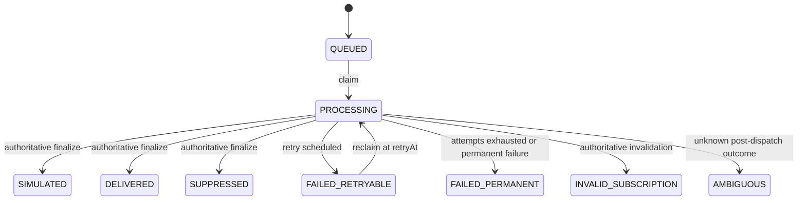
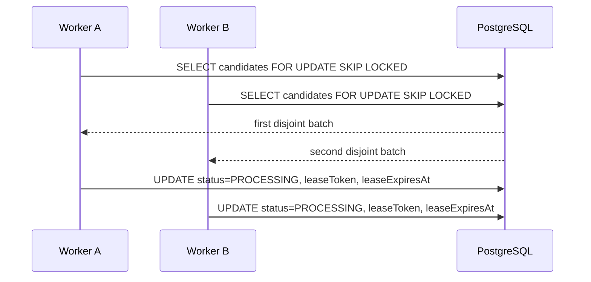
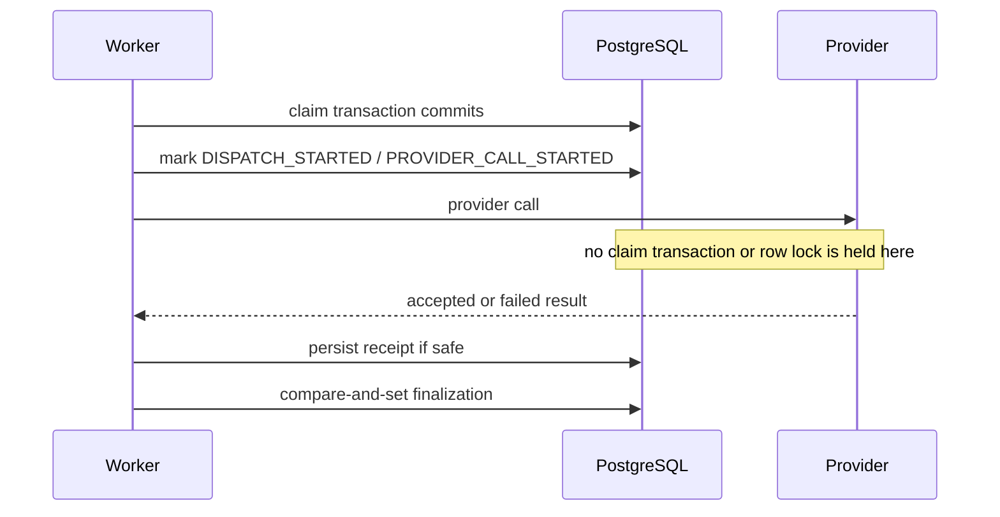
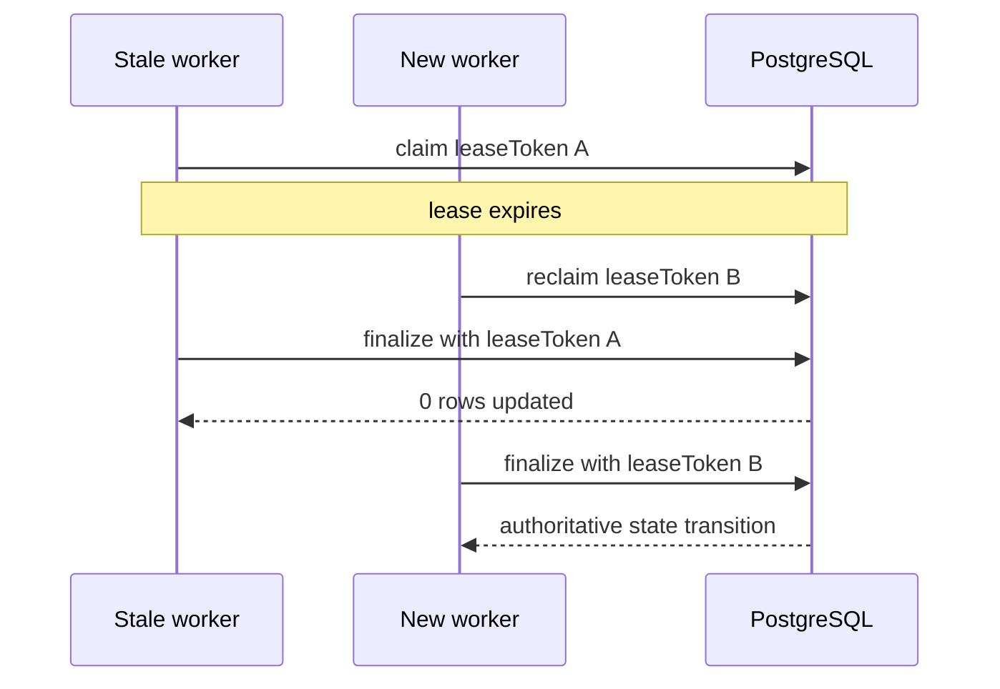
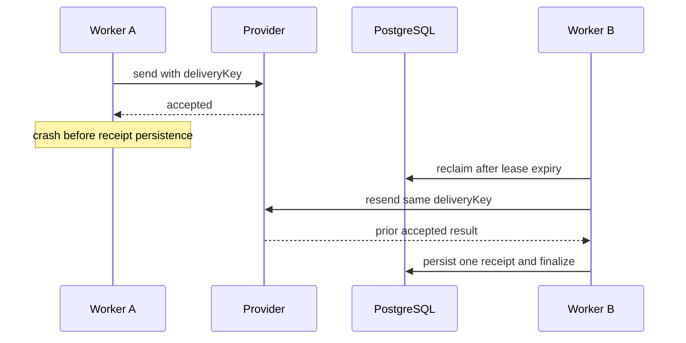
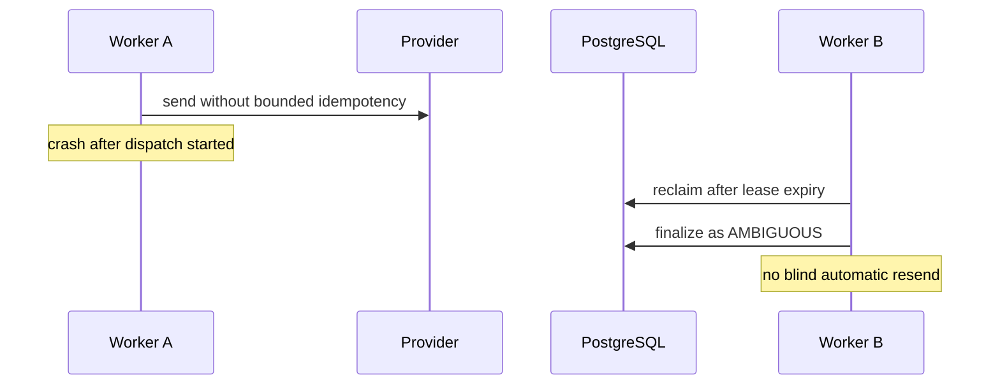

# Worker Notifications Runbook

## Scope

This runbook covers notification intent claiming, retry behavior, ambiguous
outcomes, invalid subscriptions, reminder scheduling, and safe worker shutdown
for Task 03.

## Time and lease policy

- worker timestamp columns are `timestamp without time zone`
- those values represent UTC instants by convention
- readiness and lease comparisons use
  `statement_timestamp() AT TIME ZONE 'UTC'`
- default lease: `30000` ms
- default provider timeout: `10000` ms
- required acknowledgement safety margin: at least `1000` ms

## State machine



## Claiming flow



## Provider call boundary



## Stale lease rejection



## Crash recovery by provider mode

### `GUARANTEED`



### `NONE`



## What is retried automatically

- `FAILED_RETRYABLE` rows whose `retryAt` is due
- expired `PROCESSING` rows whose prior post-dispatch state is safe to reclaim
- `GUARANTEED` deliveries after a crash window before local receipt persistence

## What requires manual reconciliation

- `AMBIGUOUS` rows
- repeated failures after `FAILED_PERMANENT`
- any provider-mode `BEST_EFFORT` or `NONE` row with an unknown post-dispatch
  outcome

## Invalid subscriptions

- invalidation occurs only during authoritative finalization
- stale lease holders cannot revoke a subscription
- invalid subscriptions are excluded from future delivery attempts

## Reminder scheduler policy

- reminders are web-push only in this checkpoint
- the scheduler uses the stored client IANA time zone
- one `ReminderOccurrence` is allowed per `(clientId, purpose, localDate)`
- occurrence planning is idempotent under repeated runs and concurrent workers
- preferred reminder times must be drawn from
  `ALLOWED_REMINDER_TIME_CHOICES`
- quiet hours default to `20:00` through `08:00`
- reminder windows expire after `SCHEDULER_CATCH_UP_MINUTES`

## Reminder dispatch revalidation

Immediately before provider send, the worker re-checks:

- preference still enabled
- occurrence still unexpired
- at least one active push subscription exists
- client is not restricted or deleted
- current local time is outside quiet hours
- mission is not already completed for that local day
- the 10-question local-day budget is not exhausted
- approved mission content is still eligible

If any check fails, the worker finalizes the intent as `SUPPRESSED` or
`EXPIRED` instead of attempting delivery.

## Safe shutdown

- stop polling for new claims
- wait for in-flight work up to `WORKER_SHUTDOWN_GRACE_MS`
- unfinished work remains recoverable by lease expiry policy

## Values that must never be printed

- names
- phone numbers
- email addresses
- employer names
- notification text bodies
- push endpoints
- push `auth` keys
- push `p256dh` keys
- answer text
- document names or contents
- invitation or verification tokens

## Safe diagnostic SQL

Use a PostgreSQL URL without the Prisma `schema` query parameter when calling
`psql`.

Queued backlog:

```sql
SELECT "status", count(*)
FROM "NotificationIntent"
GROUP BY "status"
ORDER BY "status";
```

Expired leases:

```sql
SELECT "id", "deliveryKey", "leaseOwner", "leaseExpiresAt"
FROM "NotificationIntent"
WHERE "status" = 'PROCESSING'
  AND "leaseExpiresAt" <= (statement_timestamp() AT TIME ZONE 'UTC')
ORDER BY "leaseExpiresAt", "id";
```

Exhausted attempts:

```sql
SELECT "id", "deliveryKey", "attemptCount", "maxAttempts", "lastSafeErrorCode"
FROM "NotificationIntent"
WHERE "status" = 'FAILED_PERMANENT'
ORDER BY "updatedAt" DESC, "id";
```

Ambiguous items:

```sql
SELECT "id", "deliveryKey", "provider", "lastSafeErrorCode", "updatedAt"
FROM "NotificationIntent"
WHERE "status" = 'AMBIGUOUS'
ORDER BY "updatedAt" DESC, "id";
```

Reminder occurrences for the current local day:

```sql
SELECT
  "clientId",
  "purpose",
  "localDate",
  "status",
  "suppressionReason",
  "scheduledFor",
  "expiresAt"
FROM "ReminderOccurrence"
ORDER BY "scheduledFor" DESC, "id";
```

Claim-path index notes:

- `NotificationIntent_claim_ready_idx`
  candidate predicates:
  `status`, `retryAt`, `availableAt`, `leaseExpiresAt`
- `NotificationDeliveryAttempt_notificationIntentId_attemptNumber_key`
  authoritative uniqueness for one attempt per monotonic attempt number
- `NotificationProviderReceipt_deliveryKey_key`
  authoritative uniqueness for one durable receipt per logical delivery key

The current development dataset still produces a sequential scan in `EXPLAIN`,
which is acceptable for local verification. Production expectation is an
ordered access path shaped by `NotificationIntent_claim_ready_idx` once row
counts are large enough for the planner to prefer it.
